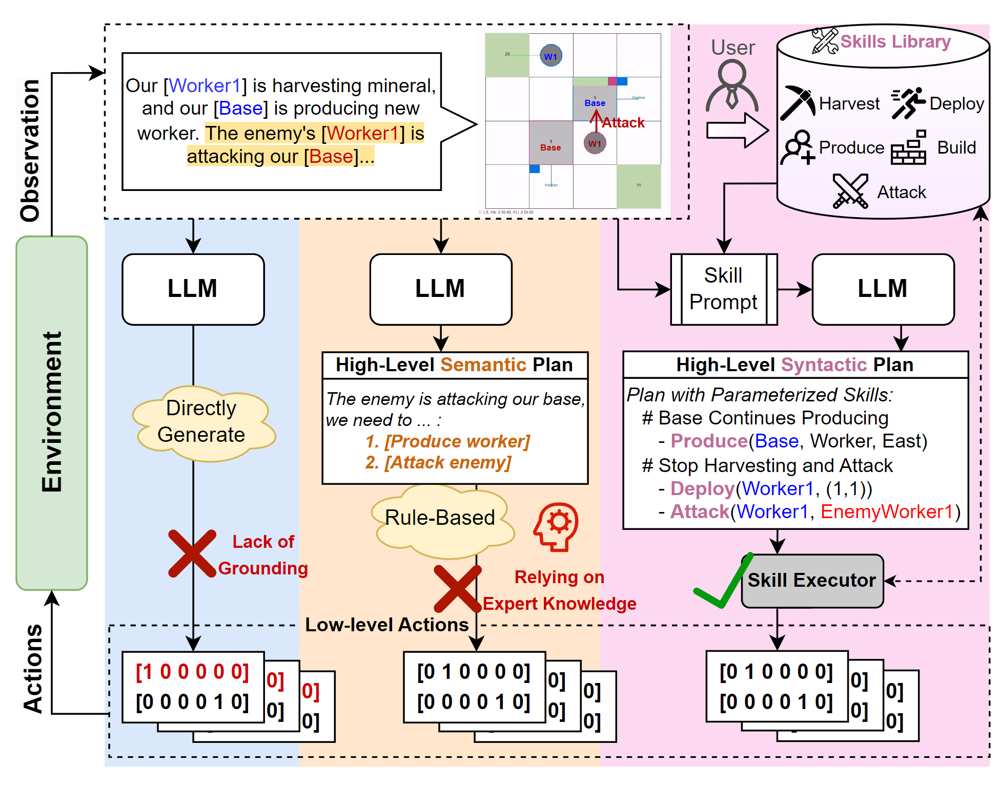

# Plan with Language, Act with Parameter

This repository is based on [microRTS](https://github.com/Farama-Foundation/MicroRTS) and [microRTS-Py v0.6.1](https://github.com/Farama-Foundation/MicroRTS-Py/tree/v0.6.1).

Plan with Language, Act with Parameter (PLAP) is a novel framework that uses predefined parameterized skills as an intermediary level to bypass the challenges of coordinating different levels in complex
sequential decision-making environments. The predefined skills can be created by non-expert users, without requiring extensive experience or knowledge. Essentially, we similarly conceal the lowlevel action space and leverage the advantage of the high-level abstract language space, but we additionally expose the parameter domain to LLM agents.



## 🕹️ Get Started

Prerequisites:

- Python 3.9+
- [Poetry](https://python-poetry.org/)
- Java 8.0+
- FFmpeg (for video recording utilities)


```bash
# The `poetry install` command above creates a virtual environment for us, in which all the dependencies are installed.
poetry install

# We can use `poetry shell` to create a new shell in which this environment is activated.
poetry shell
```

### 🤖 Ai bot vs AI bot
The following command will run a rule-based AI vs rule-based AI example:

```bash
cd PLAP

python aibot_vs_aibot.py --blue coacAI --red workerRushAI
```

Adding `--record_video` to the python command will record the game process as a video and save it. However, the prerequisite is to set the environment variables.

```bash
export DISPLAY=YOUR_IP_ADDRESS:PORT

python aibot_vs_aibot.py --blue coacAI --red workerRushAI --record_video
```

### 🎮 LLM vs Ai bot

The following command will run an example of LLM vs. rule-based AI with video recording enabled:

```bash
export OPENAI_API_KEY=YOUR_API_KEY

python llm_vs_aibot.py --blue gpt-4o --blue_prompt zero_shot --red randomBiasedAI --record_video
```

Our few shot with tips PLAP can beat [COAC](https://github.com/Coac/coac-ai-microrts), the winner of the [2020 competition](https://sites.google.com/site/micrortsaicompetition/competition-results/2020-cog-results).

https://github.com/user-attachments/assets/64267684-c17f-4979-a477-68e7d96b820a

### ⚡ LLM vs LLM

Of course we can also start LLM vs LLM battle：

```bash
python llm_vs_llm.py --blue gpt-4o --red gpt-4o-mini --record_video
```

## 📁 Directory Structure Description


```plain text
- gym_microrts/  # microRTS environment
- misc/
- PLAP/  # our project
  - configs/  # experiment configuration
  - grounding/  # grounding LLM to the original environment
    - __init__.py
    - obs2text.py  # convert observation tensor to structured text
    - script_mapping.py  # mapping LLM outputs to action tensors
    - task2actions.py  # parameterized skills
  - llm_agents/  # wrapping LLM
  - utils/
  - aibot_vs_aibot.py  # rule-based AI bot vs rule-based AI bot
  - llm_vs_aibot.py  # LLM vs rule-based AI bot
  - llm_vs_llm.py  # LLM vs LLM
- build.sh  # Compiling Java microRTS
- poetry.lock
- pyproject.toml
- README.md
```
